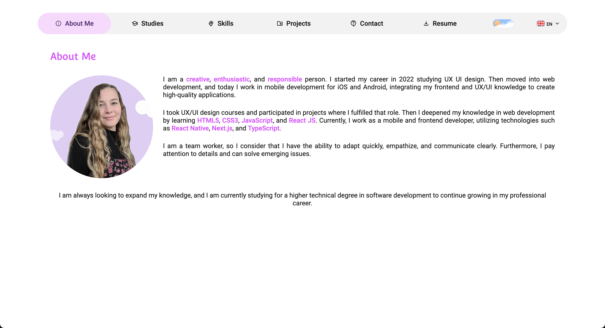
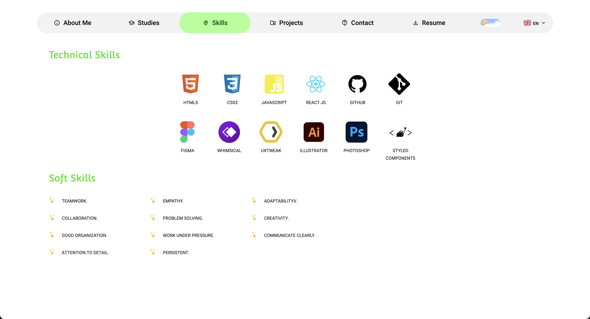
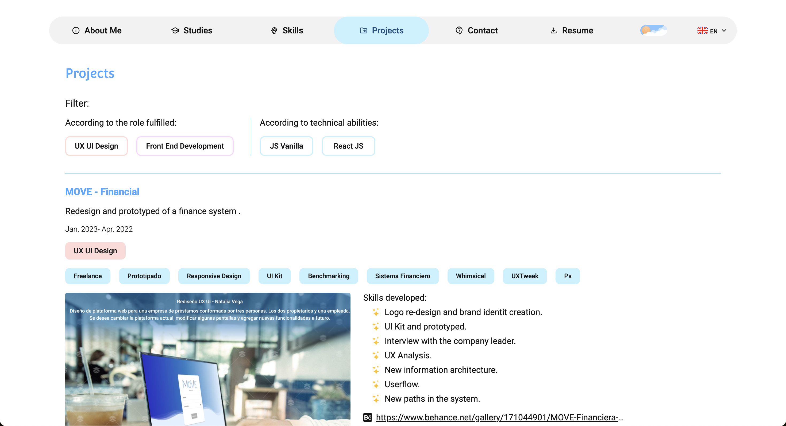

# PORTAFOLIO REACT - COMPONENTES ESTILIZADOS
- **Última actualización:** 31 de mayo de 2023
- **Versión:** 1.0.0
- **Link del proyecto:** [Portafolio Natalia Vega](https://nataliavega-portfolio.vercel.app/)

## Descripción
Este proyecto es un portafolio personal desarrollado en React. El proyecto incluye una página de inicio, una página de proyectos, una página de habilidades y una página de contacto. El proyecto incluye un tema oscuro y claro, así como la posibilidad de cambiar el idioma entre inglés y español. Además, el proyecto incluye la posibilidad de descargar el CV en inglés y español.

## Tecnologías Utilizadas
- React
- Styled Components
- React Router Dom

## Dependencias
Para ejecutar este proyecto, deberás instalar algunas dependencias. A continuación se muestra una lista de las principales dependencias que necesitarás:

- `react`: El framework utilizado para desarrollar la aplicación.
- `styled-components`: Utilizado para el estilo de los componentes.
- `react-router-dom`: Maneja la navegación entre las diferentes pantallas de la aplicación.

Puedes instalar todas las dependencias necesarias ejecutando:

```bash
npm install
```

## Instalación
Para instalar el proyecto, sigue estos pasos:

- Clona el repositorio
- Instala las dependencias
- Ejecuta el proyecto

```bash
git clone
cd portafolio-react
npm install
npm start
```

## Uso
Para utilizar este proyecto, sigue estos pasos:
- Abre el proyecto en tu editor de código
- Modifica los archivos según sea necesario
- Ejecuta el proyecto

```bash
code .
npm start
```

## Capturas de Pantalla
A continuación se muestran algunas capturas de pantalla del proyecto:

- **Version 1.0.0:** 31 de mayo de 2023







## Autor
- [Natalia Vega](https://www.linkedin.com/in/nataliacamilavega/)

## Desarrollo
- [x] Tema oscuro y claro
- [x] Multi-idioma: inglés y español
- [x] Descargar CV en inglés y español
- [x] Navegación utilizando React Router Dom
